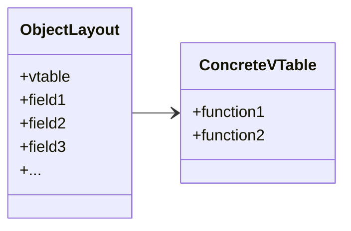
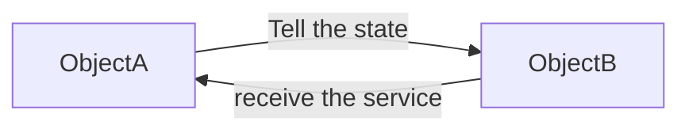
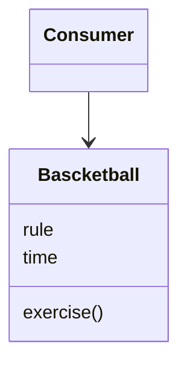
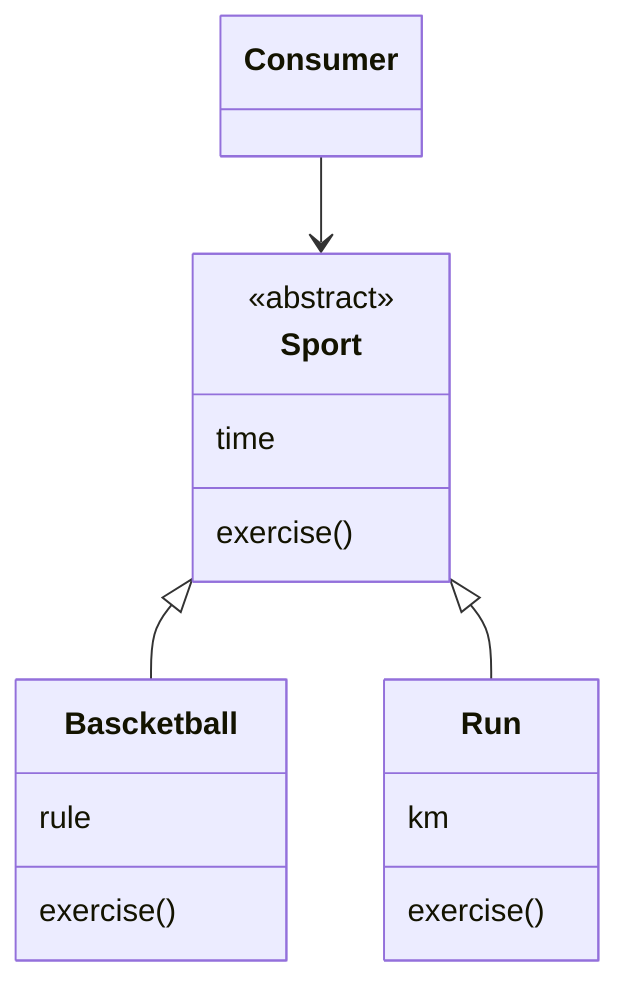

# Object Oriented Design

---

## 在程式碼裡，宣告```int a = 1```  

### 如何被記憶體儲存?

記憶體以bits (binary digit)為最小量化單位儲存資訊，代表為一個邏輯值:1/0、開/關等等
二進制數字系統（binary numeral system）是一種利用兩個不同的符號（通常是0和1）來表示數字的系統
結合二進制數字系統以及bits，即可表達不同進制的數字

具體會以幾個bits被儲存，會根據不同的計算機架構（16-bit/ 32-bit/ 64bit）、編譯器Complier、Processing(e.g. CPU最佳化)而有所不同

- [Integer numbers storage in computer memory](https://medium.com/@luischaparroc/integer-numbers-storage-in-computer-memory-47af4b59009)

- [進制簡介](https://notfalse.net/14/numeral-system-intro) *note*: 日常生活中常使用的是十進制(decimal, base 10)，逢十進位; 時間則為六十進制

### 如何被CPU拿出來運算?

1. 程式碼編譯
執行程式碼時，編譯器會將其轉化為機器碼([相關文章: .NET CLR](https://hackmd.io/CpUKcQMxTYOLjurv3UYPeA?view))，機器碼包含了一系列的指令，這些指令將被存儲在記憶體中。

2. 取指令 (Fetch)
CPU的控制單元(CU)會指示[程式計數模組 (Program Counter)](https://www.geeksforgeeks.org/what-is-program-counter/)儲存即將要執行的指令碼對應到的記憶體位置。
指令被讀取到[暫存器(CPU Register)](https://www.eagletek.com.tw/post/register-in-cpu)之後，Counter會更新到下一個位置

3. 解碼（Decode）
CU 解碼儲存在指令暫存器中的指令，決定需要進行的操作及操作所需的資料

4. 執行（Execute）
算術邏輯單元（ALU）執行計算或邏輯運算，加減乘除、AND、OR等等，然後將結果寫回到暫存器

- [ChatGPT-Brief Summary](https://chatgpt.com/c/1f0a5816-7274-4193-b5cb-d51fee08e5a1)
- [數據匯排流(Data Bus)](https://zh.wikipedia.org/wiki/%E6%80%BB%E7%BA%BF)

## 字串及日期型別可能的底層實作

### String

字串也是一連串的記憶體位置，裡面包含類似整數的字元代碼
e.g.

```cSharp
string name = "Jill"
```

```cSharp
['J', 'i', 'l', 'l']
```

7-bit ASCII Code

```cSharp
[74, 105, 108, 108 ]
```

### DateTime

早期C#並沒有DateTime型別，而是在.NET Framework 1.0版引入的

如果有一段古早的程式碼要表達日期，需要使用int型別
e.g.

```cSharp
int birthdate = 20160229
```

如果要做日期的運算，又是更為麻煩，以計算明年的生日為例

```cSharp
int birthdate = 20160229
int year = birthdate / 10000;
int month = (birthdate % 10000) / 100;
int day = birthdate % 100;

int nextYear = year + 9;

 bool isLeapYear = (nextYear % 4 == 0 && nextYear % 100 != 0) || (nextYear % 400 == 0);

if (month == 2 && day == 29 && !isLeapYear)
{
    day = 28;
}

int birthDayInNextYear = nextYear * 10000 + month * 100 + day;

```

---

## Procedural Programming

**Problem Difinition**
如果每次計算明年的生日，都要執行上面那一段指令，會很冗餘

**Solution**
一連串的指令概括為一個代稱**Procedure**，並將這段指令放在Program裡，提供一個程式的進入點(Entry Point)，帶來了隱藏複雜性跟具複用性的好處

```csharp
program
{
   GetDateInNextYear(int now);
}
```

但仍存在一些問題，例如Temporal coupling

initialize(Similar to constructor)

## Modular Programming

**Problem Difinition**
在當前的program share 同一個Modual，如果任何一個caller需要不同初始化資訊來調用該
procedure，他們會覆蓋之前的Data，因為其放置在Shared Memory block

可以理解為在操作static data value，這些value在procedures之間共享

**Soultion**
指派一個新的變數(new memory block)來存放初始化出來的值，任何調用這個變數的Consumer，需要去記住這個變數的記憶體位置(reference to data instance)，方法的調用也默認採用'this'的參照，使可以使用field

這個行為形成了物件導向世界裡的**建構函數(Constructor)**，建構了一個**物件(Object)**

而Procedures改為傳入Object作為參數，使可以對該記憶體區塊做操作，使不同的caller，能用不同的數據來調用相同的Procedure，達到真正意義上的分離

Object解決了Module共享記憶體的問題，使可以創建相同結構，但獨立的數據副本，即為所謂的**實例(instance)**

```cSharp
module SchoolCalender
 int schoolMonth
 int schoolday
 int minAge

 initilize(int month, int day, int schoolMonth)
    schoolMonth = month
    schoolDay = day
    minAge = age

```

## Object Oriented Programming

隨著物件的出現，以上的型式便衍生了新的說法: class, field, function，
當宣告一個class，並有一個int型別的age，代表著物件被實例化時，會被分配4 bytes來儲存，這就是其中field的內涵。initialize()則被轉化為Constructor, procedure被轉化為function

### 記憶體分配

```CSharp
var pen = new Pen(color);
pen.Write();
```

此時pen已佔用了記憶體，若長期放置，在使用完後不被刪除，則會造成*Memory Leak*
在C++裡，可以手動釋放記憶體(*Memory Deallocation*)

```C++
delete pen
```

手動釋放記憶體存在一些可能的人為錯誤，包含:

1. 懸空指標(*Dangling pointer*) : 在仍有代碼有pointer指向某物件時，但他卻被刪除，指向的記憶體位址是空的。

2. Reading Garbage: 在上述情況，原記憶體區段被賦予了新的值，導致指向非預期的目標

3. Memory leak: 物件不使用了卻沒刪，導致記憶體占用問題

在C#裡，則會統一透過**Garbage Collection**管理記憶體，由系統判斷，在需要時調用，不需要時釋放

### C# Language syntax

#### Method

##### 定義

- 執行某些計算，**改變物件**的狀態或值
- 根據既有的data，**產生某些結果**並回傳

>*最好不要讓兩個行為塞在同一個Method，很容易產生很多奇怪的Bug*

##### Functional language v.s. Object Oriented language

前者會自動使用方法生成的最後一個值作為傳回值(Implict return value)，物件導向語言則不允許，需要有明確傳回值，除了Void，但Void也不作為一個型別

#### Access Modifiers

用於定義類別裡的成員，能否被更改或調用

#### Program Entry Point

透過向Operation System(OS)提供指令，OS接收到指令後，會去尋找程式的進入點並執行(run)Program e.g. ```app.exe```

執行時也允許帶一些參數 e.g. ```app.exe 1 2 3```
而這些參數也需要一些記憶體區塊來存取，所以需要string[] args

```cSharp
class Program
{
    static void Main(string[] args)
    {
        //do something
    }
}
```

##### 以物件的角度來看Program

應該要期許OS實例化一個Program，調用其中的Main function, 並傳入參數args

但**OS無法支援對物件的操作**，所以實際上Program在OS裡還是被視為一個有單一進入點(Main function)的Code block，在Command輸入的參數也被傳入進入點，並執行這段Procedure

但這樣子誰來實例化Program物件以執行Main()?
=> 沒有辦法實例化，所以需要**加修飾詞static，以代表這段function不屬於任何物件**

結論: Main()不是任何一個物件的function，在function裡沒有任何隱含的'this' Reference

ref: [Udemy-Understanding Program Entry Point](https://www.udemy.com/course/beginning-oop-with-csharp/learn/lecture/28443464#notes) 講得蠻好的，建議重看

### Polymorphic Classes

#### 替代原則(Object Substitution Principle)

透過繼承(inherit)，基底(Base)物件可以被派生(Derived)物件替代

派生物件可以使用基底物件的所有屬性、欄位、方法

### Polymorphic Execution(Dynamic Dispatch)

#### Definintion

- vTable的Funtion在編譯時，不會實際對到某個記憶體區塊
- 編譯器會分配vTable給每個class
- 物件被實例化時，會分配pointer(vTable pointer, a memory address)到object的layout中

>*ref*:講得蠻好的，建議重看
>
> 1. [Virtual functiom](https://www.udemy.com/course/beginning-oop-with-csharp/learn/lecture/28506609#overview)
> 2. [Implementing Polymorphic Method Calls](https://www.udemy.com/course/beginning-oop-with-csharp/learn/lecture/28506611#overview
)
---
已知Derived Object 可以使用 Base Object 的方法，但如果有一樣命名的方法，該執行哪一個?

e.g.
我有一份健身菜單，基本的行為Exercise()是執行跑步

健身菜單衍生出了三種不同的類型，分別為胸, 背, 腿的菜單

此時會期望如果new出來的菜單是胸，執行的Exercise()可以自動幫我換為胸推

```cSharp
namespace ObjectOrientedDesign
{
    public class WorkoutPlan
    {
        public void Exercise()
        {
            Console.WriteLine("run");
        }
    }

    public class Chest : WorkoutPlan
    {
        public void Exercise()
        {
            Console.WriteLine("Bench Press");
        }
    }
    
    public class Back : WorkoutPlan
    {
        public void Exercise()
        {
            Console.WriteLine("Pull Ups");
        }
    }
    
    public class Leg : WorkoutPlan
    {
        public void Exercise()
        {
            Console.WriteLine("Squats");
        }
    }

    internal class Program
    {
        public static void Main(string[] args)
        {
            WorkoutPlan chestPlan = new Chest();
            WorkoutPlan backPlan = new Back();
            WorkoutPlan legPlan = new Leg();
            
            chestPlan.Exercise();
            backPlan.Exercise();
            legPlan.Exercise();
        }
    }
}

```

此時執行程式碼會怎樣?

```Bash
> dotnet run
# C:\Users\User\RiderProjects\Lab\ObjectOrientedDesign\ObjectOrientedDesign\Program.cs(13,21): warning CS0108: 'Chest.Exercise()' 會隱藏繼承的成員 'WorkoutPlan.Exercise()'。若本意即為要隱藏，請使用 new 關鍵字。 [C:\Users\User\RiderProjects\Lab\ObjectOrientedDesign

#\ObjectOrientedDesign\ObjectOrientedDesign.csproj]C:\Users\User\RiderProjects\Lab\ObjectOrientedDesign\ObjectOrientedDesign\Program.cs(21,21): warning CS0108: 'Back.Exercise()' 會隱藏繼承的成員 'WorkoutPlan.Exercise()'。若本意即為要隱藏，請使用 new 關鍵字。 [C:\Users\User\RiderProjects\Lab\ObjectOrientedDesign\ObjectOrientedDesign\ObjectOrientedDesign.csproj]

#C:\Users\User\RiderProjects\Lab\ObjectOrientedDesign\ObjectOrientedDesign\Program.cs(29,21): warning CS0108: 'Leg.Exercise()' 會隱藏繼承的成員 'WorkoutPlan.Exercise()'。若本意即為要隱藏，請使用 new 關鍵字。 [C:\Users\User\RiderProjects\Lab\ObjectOrientedDesign\ObjectOrientedDesign\ObjectOrientedDesign.csproj]
run
run
run

```

會連續3次都是跑步，並不符合預期

#### Virtual function

在修正之前，先談談object layout & vTable

##### vTable

Vitural method table(虛擬表)，Compiler 會自動為每個物件建立，並且**會被繼承**，是記憶體裡指向function的指標陣列，每個指標為vptr（虛指針）

function pointer的概念在電腦發明的初期就已經存在，用於指向某段方法的記憶體位置，並跳過去執行

##### Object layout

Runtime時，由Complier決定instance要在記憶體分配什麼樣的結構、儲存方式、順序。 包含了物件裡的所有成員，包含數據(e.g. property, field)及隱含的成員(e.g. vTable, vptr)



從剛範例的基底類別WorkoutPlan來看，起來可能會長這樣

```cSharp
//the method to use functions in vTable may looks like:
call(instance, index, args )
{
    VTable vTable = instance.functions;
    MemoryAddress function = vTable[index];
    return function(args);
}

public class WorkoutPlan
    {
        //added by compiler in run time
        VTable  workoutfunction =  
        0 : WorkoutPlan.Exercise() //vptr : function
        1 : WorkoutPlan.DoSometing()
    

        function[] = workoutfunction()  //added by compiler in run time

        public void Exercise()
        {
            Console.WriteLine("run");
        }

        public void DoSomething(){};
    }
```

#### Base

vTable也會繼承建構函數，C#提供一種語法用來代表在derived object初始化了繼承來的欄位: *Base*

```cSharp
public class WorkoutPlan
{
    private int _duration;

    public WorkoutPlan(int duration)
    {
        _duration = duration;
    }
}

public class Chest : WorkoutPlan
{
    public Chest(int duration) : base(duration)
    {
    }
}

```

#### Overide

derived object 可以覆蓋掉Base Object的function
把vptr原本指向base物件方法的記憶體位址，改為指向derived object的方法，即為Overide

VTable  workoutfunction
{
    ~~~0 : WorkoutPlanFunction[0]~~~
    0 : Chest.Exercise  
}

```cSharp

Chest chest = new WorkOutPlan();
chest.Exercise()  

//在runtime，會看起來像是:
Call(this, 0, args)  
```

如果Override WorkOutPlan.Exercise()  這個index最後會指向Chest class的Exercise()實作

會選擇哪個function來實作(選擇哪個記憶體區塊)，是**在run time處理**的

#### Implement

試著回來修改最一開始的範例，把所有function都放入vTable並於run time計算是耗費效能的

所以C# 設計為base object有以修飾詞標示為**virtual**的方法，才會納入vTable，並動態解析

其他的function則維持靜態(static)解析，在編譯(Compile)時就解析

derived object 則必須加上overide，才會真的改為指向自己的實作，不然會出現上面的warning

```warning CS0108: 'Back.Exercise()' 會隱藏繼承的成員 'WorkoutPlan.Exercise()'。若本意即為要隱藏，請使用 new 關鍵字。```

修改後的程式碼如下，保留Leg沒有Overide

```cSharp
namespace ObjectOrientedDesign;

public class WorkoutPlan
{
    private int _duration;

    protected WorkoutPlan(int duration)
    {
        _duration = duration;
    }

    public virtual void Exercise()
    {
        Console.WriteLine("run");
    }
}

public class Chest : WorkoutPlan
{
    public override void Exercise()
    {
        Console.WriteLine("Bench Press");
    }

    public Chest(int duration) : base(duration)
    {
    }
}
    
public class Back : WorkoutPlan
{
    public override void Exercise()
    {
        Console.WriteLine("Pull Ups");
    }

    public Back(int duration) : base(duration)
    {
    }
}
    
public class Leg : WorkoutPlan
{
    public void Exercise()
    {
        Console.WriteLine("Squats");
    }

    public Leg(int duration) : base(duration)
    {
    }
}

internal class Program
{
    public static void Main(string[] args)
    {
        WorkoutPlan chestPlan = new Chest(10);
        WorkoutPlan backPlan = new Back(20);
        WorkoutPlan legPlan = new Leg(30);
            
        chestPlan.Exercise();
        backPlan.Exercise();
        legPlan.Exercise();
    }
}

```

Output

```bash
> dotnet run
#C:\Users\User\RiderProjects\Lab\ObjectOrientedDesign\ObjectOrientedDesign\Program.cs(44,17): warning CS0114: 'Leg.Exercise()' 會隱藏繼承的成員 'WorkoutPlan.Exercise()'。若要讓目前的成員覆寫該實作，請加入 override 關鍵字; 否則請加入 new 關鍵字。 [C:\Users\User\RiderProjects\Lab\ObjectOrientedDesign\ObjectOrientedDesign\ObjectOrientedDesign.csproj]
Bench Press
Pull Ups
run  ##Unchanged
```

#### Summary: Polymophism(多態性)是什麼

一個物件可以以多種樣貌呈現，實作上透過繼承來實現，透過一些在基底類別的共同屬性，以及衍生類別自己的屬性

來呈現出真實世界裡，相同類別的東西，有點一樣，又有些不一樣的現象

而這些物件又會有相似的行為，但實際操作起來，又有些不一樣，例如範例裡的物件，健身菜單

各種不同的菜單都要執行Excercise()的行為，但實際怎麼操作又有些不同

這種現象被使用Vtable來在計算機的世界定義

整個物件導向設計都圍繞著

1. **'this' reference**

2. **Virtual method table**

=> 現在是誰在執行行為? 有沒有動態執行方式?

## Introduction of Project and Solution

### .NET Assembly(組態)

Solution裡可以有許多Projects，每個project可以被編譯並建置到一個項目中，稱為Assembly

Assembly可以透過IDE裡的Build被建置，可以直接對project建置，或對整個Solution建置

```powershell
0>------- Started building project: ObjectOrientedDesign
ObjectOrientedDesign -> C:\Users\User\RiderProjects\Lab\ObjectOrientedDesign\ObjectOrientedDesign\bin\Debug\net8.0\ObjectOrientedDesign.dll

0>------- Finished building project: ObjectOrientedDesign. Succeeded: True. Errors: 0. Warnings: 0

Build completed in 00:00:01.045

```

可以看到建置後產生了一個路徑，指向ObjectOrientedDesign.dll


### Dynamic link library (DLL)

建置 .NET project後產生的Assembly

build 整個 solution，就會為底下的每個project建置DLL

Compiler會檢查程式碼是否有更改，若都沒有，就會採用之前的DLL，以節省資源

### 專案的資料夾裡有什麼


#### .csropj

CSharp project files

以 XML 格式定義專案使用的SDK、參考的套件、編譯選項(C# 的語言版本、是否啟用代碼分析、警告級別等)、定義不同的組態(e.g. Debug / Release分別的設定)

```XML
<Project Sdk="Microsoft.NET.Sdk">

  <PropertyGroup>
    <OutputType>Exe</OutputType>
    <TargetFramework>net8.0</TargetFramework>
    <ImplicitUsings>enable</ImplicitUsings>
    <Nullable>enable</Nullable>
  </PropertyGroup>

  <ItemGroup>
    <PackageReference Include="Newtonsoft.Json" Version="13.0.1" />
  </ItemGroup>

</Project>

```

#### .cs

撰寫的原始碼，此處看到的是建專案時被建立出來的program class

#### bin folder

存放binaries(二進位)資料

裡面依序包含以下資料夾

#### Debug folder

存放Configuration資訊

##### .NET 8.0 Folder

每個project能以不同的.NET版本部屬，Complier會根據版本為資料夾命名


資料夾裡存放所有建置需要的內容，如果想要把應用程式部屬到另外一台電腦，**需要複製所有內容**

- json files : 跟Configuration有關

- pdb file : 用於Debug

- .exe : 用於執行程式 .NET Core是跨平台架構(Window, Linux, MacOS)皆可運行建置產生的組態。 這裡看到的.exe是給windows用的

打開cmd可以發現可以直接執行這份.exe

```> ObjectOrientedDesign.exe```

也可以直接執行組態，但要給他 .NET 的command line tool
```>dotnet ObjectOrientedDesign.dll```

```cmd
Microsoft Windows [版本 10.0.22631.3737]
(c) Microsoft Corporation. 著作權所有，並保留一切權利。

C:\Users\User\RiderProjects\Lab\ObjectOrientedDesign\ObjectOrientedDesign\bin\Debug\net8.0>ObjectOrientedDesign.exe
Bench Press
Pull Ups
Squats

C:\Users\User\RiderProjects\Lab\ObjectOrientedDesign\ObjectOrientedDesign\bin\Debug\net8.0>ObjectOrientedDesign.dll

未處理的例外狀況: System.IO.FileNotFoundException: 無法載入檔案或組件 'System.Runtime, Version=8.0.0.0, Culture=neutral, PublicKeyToken=b03f5f7f11d50a3a' 或其相依性的其中之一。 系統找不到指定的檔案。

C:\Users\User\RiderProjects\Lab\ObjectOrientedDesign\ObjectOrientedDesign\bin\Debug\net8.0>dotnet ObjectOrientedDesign.dll
Bench Press
Pull Ups
Squats
```

### NameSpce

以```Console.WriteLine("run")```這行為例，Compiler執行到這行時，看到命名空間是'Console'並往上找驗證，找到的命名空間為ObjectOrientedDesign，但這個命名空間裡並沒有Console這個class，並不符合

接著就會再往上檢查using的namespace裡，有沒有有包含Console class的，此時會發現System符合，並成功編譯

```csharp
using System;

namespace ObjectOrientedDesign;

public class WorkoutPlan
{
    private int _duration;

    public virtual void Exercise()
    {
        Console.WriteLine("run");
    }
}


namespace System
{
    public static class Console
    {
        //...
    }
}
```

## Design a Class

### Static

- only conatain static members
- can not conatin instance-level fields or methods
- **static methods** are equal to procedure，it's not contain any OOP concept

*Note:* 雖然在OOP不傾向使用static ， 但functional programing是會使用的

### Encapsulation(封裝)

被宣告為private的field，除了所屬的class以外，皆無法訪問

外部調用這個class時，是無法看到這些欄位的內容的

- 增加這種限制有什麼好處?
讓其他的class無法依賴這個欄位，日後要修改這個欄位也會變得容易，而不會影響到調用方

### New 一個 Object 如何分配記憶體

變數在記憶體的儲存方式有兩種: Reference types, value types，以下分別介紹

```csharp
namespace Calendars;

internal class Date(int year, int month, int day)
{
    public int Year { get; set; } = year; 
    private int _month = month;
    private int _day = day;
}
```

```csharp
namespace Calendars;

internal class Child(string? name, Date? birthday)
{
    private string? _name = name;
    public Date? Birthday { get; set; }
}
```

```csharp
int year = 2016;
var date = new Date(year, 1, 1);
var child = new Child("Jill", date);
```

#### Reference Type

包含: String, Array, Class
這種類型的變數會儲存對數據實際記憶體位址的參考，而數據本身通常以heap被動態分配在記憶體區塊

**String**並不是直接以值儲存的原因在於它在編譯時，並沒有固定長度，固定的只有這個記憶體位址的所占容量，64 bit的電腦會使用8個bytes / 32 bits 則是4個bytes

用以上程式碼為例，變數child在記憶體分配的object layout裡，並不是直接儲存了某個物件Child的某種值在記憶體裡，而是字串"Jill"會先被分配到某段分別儲存'J', 'i', 'l', 'l'的memory block，這個memory block的位址再被複製到child物件，讓child指向他

並且Child也指向另一個物件Date的記憶體位址

#### Value Type

包含: int, float, char, bool, enum, 以及所有的結構（struct）e.g. DateTime

當這些型別的變數被宣告時，記憶體會直接分配一個空間儲存這些值

並且當其他變數引用值型別的變數時，會直接**複製值**，而非像Reference type是儲存該記憶體位址

#### Reference Type v.s. Value Type

| Feature                   | Reference Types                      | Value Types                            |
|---------------------------|--------------------------------------|----------------------------------------|
| **Storage**               | Stored on the heap.                  | Stored on the stack.                   |
| **Access**                | Accessed via a reference.            | Accessed directly by their value.      |
| **Memory Allocation**     | Dynamically allocated during runtime.| Allocated at compile time.             |
| **Life Cycle**            | Managed by garbage collector.        | Managed by the scope they are defined in. |
| **Copying Behavior**      | Copies the reference, not the object.| Copies the actual data/value.          |
| **Example Types**         | `string`, `class`, `array`            | `int`, `float`, `struct`, `enum`       |
| **Modification Impact**   | Changes affect all references.       | Changes affect only the instance modified. |
| **Performance**           | Generally slower due to indirection. | Generally faster due to direct access. |
| **Use Case**              | Ideal for large data structures.     | Best for small and immutable data.     |

#### Sample and explaination

用以下程式碼來說明

```csharp
using Calendars;

int year = 2016;
Date date = new Date(year, 1, 1);
Child child = new Child("Jill", date);

year = 2017;
Console.WriteLine(date.Year); //2017

date.Year = 1999;

Console.WriteLine(child.Birthday.Year); //1999

```

- date.Year會輸出2017而不是2016，因為編譯時，2016這個值就已經被複製到另一個記憶體區塊A，並讓date變數的object layout(區塊X)指向這個區塊A
區塊A裡的值是2016，所以輸出是2016

- child變數指向的是記憶體區塊B，存放字串Jill的位址，和記憶體區塊C，存放Date的位址(區塊X)，這個位址和變數date指向的是一樣的

而後，區塊A的值被改為1999

區塊C(child)指向區塊X(date)，區塊X指向區塊A(date.year)

最後得到值 1999，因為他的的值都是參考來的

## Design a vitural method

- 每個class都預設繼承Object

- 一個class最多繼承一個class，有自訂的繼承時則移除預設繼承object的行為

- 繼承可以形成一個鏈，接連繼承下去 z繼承y, y 繼承x , x繼承object

> 為什麼要統一繼承object?
提供了一些每個物件可能常用的方法，例如.ToString()
不然每次要toString()，
要先```System system = new System```, ```system.ToString()```

- 在override的function實作裡，要調用base class的function, 要加**base**，用以區格，並快速尋找vTable e.g. ```base.ToString()```

- 若以數字值作為字串傳回值，會自動調用ToString

## "Tell, Don't Ask" principle

1. Disclose own data

2. Tell co-object what to do, don't ask private data directly

3. let object use its private data according to your request

OOP會避免procedural design, 把所有程序一長串的寫完。 而是將行為分配給合適的物件
真實情況下完成一個行為往往需要多個物件協作，此時，應該要把其中幾項物件的狀態委派(delegate)給其他物件裡的方法

- 當設計上善用封裝，private field也會驅使自己在需要時將狀態傳遞給其他物件，而非全部設為public隨意調用導致行為沒有被放置在應該存在的類別，導致耦合

>物件導向設計方法的行為是**給予狀態並取得服務**
>
> procedure則相反，是取得狀態來自行執行服務，會導致物件之間緊密耦合，因為調用方被注入了其他物件的結構
> 兩者差異在於資料的流動，OOP從this object傳遞私有狀態至協作的物件，保持數據的封裝性。 相反地，**要求協作物件給予資料，往往是設計上的anti-pattern**




## Chaining method calls

當方法適當的拋送職責給不同的物件後，這些function會被連續的呼叫已完成某個行為，可稱為**call chain** / **pipeline**

這些方法具有組合性，可以聚集他們已完成來完成某個複雜功能

```csharp
    public Date GetBeginning(Child child)
    {
        Date oldEnough = child.GateDateByAge(minAge);

        Date cutoff = oldEnough.GetFirstOccurance(cutOff);
        
        return cutoff.GetFirstOccurance(_schoolStart);
    }
```

chain call可精簡成以下寫法

```csharp
    public Date GetBeginning(Child child)
    {
        return child.GateDateByAge(minAge)
            .GetFirstOccurance(cutOff)
            .GetFirstOccurance(_schoolStart);
    }
```

Expreeeion body

更像是一個數學的運算式，把一個domain的資料送到codomain計算後取回

要精簡為expression body有一個約束，**只能包含一個表達式**

但是這樣有括弧來撰寫不是更方便嗎?

實際上，這種約束是在協助實踐**Command-Query Seperation(CQS)**

避免同時可以產出(produce)結果(Query)，又可以執行某些行為(Command)的function

因為往往會因為無法預期有東西會被改變而造成caller困惑

```csharp
public Date GetBeginning(Child child) =>
        child.GateDateByAge(minAge)
            .GetFirstOccurance(cutOff)
            .GetFirstOccurance(_schoolStart);

```

## Selector

對比於pipeline，選擇一種function來執行，常與三元運算符等pattern matching搭配

two possible result

```csharp
    private Date FirstValidDate(int year, YearDate day)
    {
        if (_day.IsLeap() && !year.IsLeap())
        {
            return new Date(year, day.AddDays(1));
        }
        return new Date(year, day);
    }
```

> 將複雜的實作拆解為pipeline或selector，最後再加以組合，會使它們變得簡單

## Recursion

### Activation frame

- 又稱為Activation record, stack frame
- 是在function被調用時，儲存的資料結構
- 結構為後進先出(LIFO)
- 在Call Stack上動態管理，儲存了參數、局部變數(local variables)、傳回的地址(return address)

> **每次遞迴都會產生一個Activation frame，並推入call stack，再依照LIFO的特性，逐一回到最開始的傳回位址

## Object Substitution principal (物件可替換性原則)

Origin



新增需求，要再加一個跑步

原本Consumer調用Bascketball class來執行exercise()，現在也要能對Run class執行

將一個物件拿來替代另一個物件，即為Object Substitution principal，可以透過繼承來實現

但Consumer已經reference了Backetball物件，就算新增了Run物件也無法調用

此時新增一個BaseObject **Sport**，提供給Consumer統一調用，再讓Backetball及Run繼承他，此物件即可動態的替換

```Sport sport = new Bascketball();```
```Sport sport = new Run();```

> 對物件的reference可以被轉換為其derived type，n層以下的derived type皆可，這個行為稱為**Upcast**



*Note*: 過度深層的繼承通常被視為一種anti-pattern

1. 脆弱的基底類別問題：當繼承鏈過長時，底層的改變可能會影響到所有衍生的類別

2. 重複代碼：繼承通常用來共享代碼，但過度使用繼承可能導致不必要的重複，尤其是當衍生類別只需要基底類別的部分功能時。

3. 類別爆炸：隨著繼承層次的增加，相應的類別和子類別也可能迅速增加

## Liskov substitution principle (LSP)

>What is wanted here is something like the following substitution property:
>
> If for each object o1 of type S there is an object o2 of type T such that for all programs P defined in terms of T, the behavior of P is unchanged when o1 issubstituted for o2 then S is a subtype of T
>
> 如果對於每個類型為 S 的物件 o1，都存在一個類型為 T 的物件 o2，使得對於所有以 T 為基礎定義的程式 P，當 o1 替換為 o2 時，P 的行為保持不變，那麼 S 就是 T 的子類型。

程式中使用基底類別的地方都應該能透過子類實體來替代，而不會影響程式的執行結果

### Example of a Violation of LSP

分析LSP是如何以明顯和不明顯的方式被違反的papper，建議閱讀:
 [The Liskov Substitution Principle](https://web.archive.org/web/20151128004108/http://www.objectmentor.com/resources/articles/lsp.pdf)

- 無法收斂的程式碼更改

因為依賴Run-Time Type Information (RTTI)，導致許多型別的判斷，並且每次新增子類，都會導致要跟著更改，不符合開放封閉原則

```C++
void DrawShape(const Shape& s)
{ 
if (typeid(s) == typeid(Square))
DrawSquare(static_cast<Square&>(s));

else if (typeid(s) == typeid(Circle))
DrawCircle(static_cast<Circle&>(s));
}
```

- 多餘的記憶體耗用
實際上Square並不需要同時設定長和寬

```csharp
public class Rectangle
{
    private double _height;
    private double _width;

    public double Height
    {
        get => _height;
        set => _height = value;
    }

    public double Width
    {
        get => _width;
        set => _width = value;
    }

    public override string ToString() => $"width: {_width},  height: {_height}";  
}

public class Square : Rectangle
{
}

internal static class Program
{
    public static void Main(string[] args)
    {
        Rectangle square = new Square();
        square.Height = 10;
        square.Width = 10;
        Console.WriteLine(square);
    }
}


```

- 基底類別的方法並沒有適用子類別，使用Virtual的同時，無法說明原本的物件設定的好好的，為什麼子類別加入之後，他就必須要改為virtual

```csharp
public class Rectangle
{
    private double _height;
    private double _width;

    public virtual double Height
    {
        get => _height;
        set => _height = value;
    }

    public double Width
    {
        get => _width;
        set => _width = value;
    }


    public override string ToString() => $"width: {_width},  height: {_height}";
    
    
}

public class Square : Rectangle
{
    public override double Height
    {
        get => base.Height;
        set
        {
            base.Height = value;
            Width = value;
        }
    }
}

internal static class Program
{
    public static void Main(string[] args)
    {
        Rectangle square = new Square();
        square.Height = 10;
        Console.WriteLine(square);
    }
}

```

目前為止看起來透過virtual，可以讓這兩個物件動態互換，並且又維持各自的Setter行為，但是仍存有真正嚴重的問題

- **根據caller的不同視角，可能會產出超出預期的行為**

用Square視角來執行g function，就會出錯

再回頭看看LSP的定義，並換成以下案例

> 類型為 Square 的物件 o1，都存在一個類型為 Rectangle 的物件 o2
>
> 以 Rectangle 為基礎定義了程式 g

當 o1 替換為 o2 時，*g的行為應該要保持不變*

結論: 違反LSP

```csharp
using System;
using System.Diagnostics;

public class Rectangle
{
    public int Width { get; set; }
    public int Height { get; set; }
    
    public virtual void SetWidth(int width)
    {
        Width = width;
    }

    public virtual void SetHeight(int height)
    {
        Height = height;
    }

    public int GetWidth()
    {
        return Width;
    }

    public int GetHeight()
    {
        return Height;
    }
}

public class Square : Rectangle
{
    public override void SetWidth(int width)
    {
        Width = width;
        Height = width; 
    }

    public override void SetHeight(int height)
    {
        Width = height;
        Height = height; 
    }
}

public class Program
{
    private static void g(Rectangle r)
    {
        r.SetWidth(5);
        r.SetHeight(4);
        Debug.Assert(r.GetWidth() * r.GetHeight() == 20, "Assertion failed: Width * Height is not equal to 20.");
    }

    public static void Main()
    {
        Rectangle rect = new Rectangle();
        Rectangle sqr = new Square();
        
        g(rect); // Works fine
        g(sqr); // Assertion fails because sqr is a Square, not a Rectangle
    }
}

```

```> Process terminated. Assertion failed.```

### Summary

不是單獨看Model內部就能有意義的驗證符合LSP，還需要結合用戶端的使用情境

將現實中的"is a"翻譯成電腦裡的"繼承"，可能是太過直觀的

"is a" 除了field，還必續包含行為也一致，並且是指"public behavior"

Square可以是Rectangle(多態)，但Square instance絕對不可能是Rectangle instance

有太多相似但不全然是的情境，如果無法確保基底類別的行為能完全被子類別取代，建議**以組合取代繼承**

